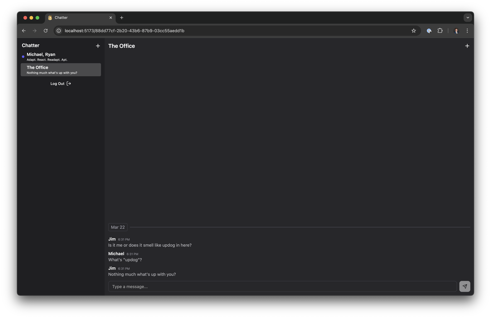
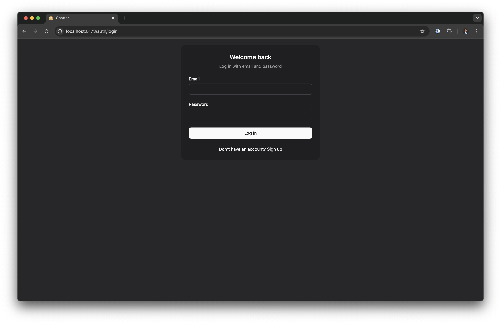

Java Spring backend for a chat app.

- Kafka for managing new messages
- Cassandra for storing messages
- Postgres for storing accounts, chats, and chat members
- WebSockets for sending new messages to active chat members

Also see [Chatter Backend](https://github.com/joshuackeller/chatter-backend)

